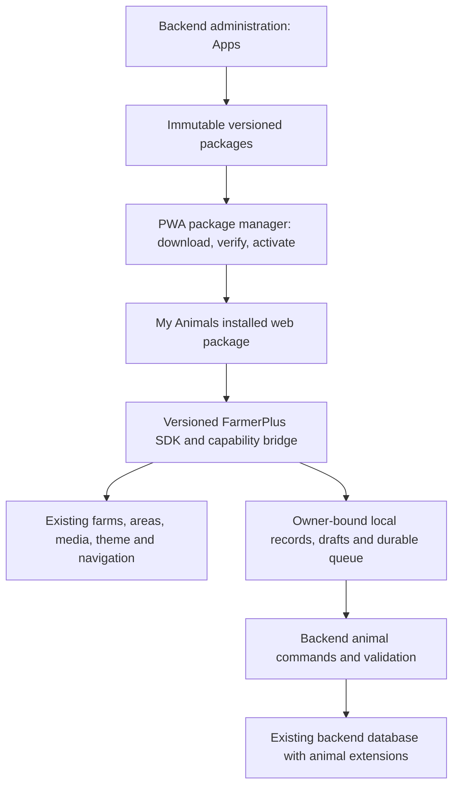

# My Animals: product, UX and implementation plan

**27 September 2026 · Proposal only · No application changes or deployment**

## 1. Recommendation

Build **My Animals** as the first downloadable mini-app on a reusable FarmerPlus mini-app platform. Store its released screens, client behaviour, icon and breed catalogue in Backend-managed packages. Install a verified copy in the PWA for offline use. Keep authoritative validation and account data in the existing backend, and give mini-apps a controlled interface to the main app's farms, locations, media, storage, navigation and sync.

The user requested planning only. The pasted brief's instruction to implement immediately does not apply to this task. Both text attachments are requirements and ideas for this plan; the image is a screen-flow reference. No logo, working screens or APIs have been implemented.

Companion: [Proposed mini-app API reference](mini-app-api-reference-proposed-2026-09-27.md).

### Version 1 scope

- Individuals and groups; Cattle, Pigs, Chicken, Goats and Sheep.
- Add, find, edit, archive and remove mistaken animal records with preserved audit history.
- Dated births/hatching, purchases/additions, departures, moves, weights, care, observations, completed treatments and notes.
- Existing FarmerPlus accounts, farms and areas; optional photos and custom breeds.
- Offline drafts, records, installation state and reconnect handling.
- App Store installation and a Backend administration **Apps** section.

Task lists, future reminders, schedules, diagnosis, breeding predictions, financial accounting and a third-party public marketplace are outside this first release. Existing unrelated applications continue to operate.

## 2. What exists today

| Evidence inspected | Current behaviour | Planning consequence |
|---|---|---|
| `lib/ui.dart`, `farmTheme` | Material 3, Roboto, blue seed `#3157ED`, light surface `#F5F7FF`, dark surface `#111A33`, 16px input corners, 52px primary buttons | Inherit the actual app theme. The green attachment is inspiration for structure. |
| `lib/ui.dart`, `AppArtwork`; `lib/appearance.dart` | Colourful rounded app icons; wallpaper and glass styling on Home | Give My Animals a sibling icon; keep ordinary forms on readable surfaces. |
| `lib/domain.dart`, `lib/main.dart` | Compiled catalogue and launcher switch | Add a generic launcher for installed web packages. Keep existing compiled apps working. |
| `lib/pwa_main.dart`, `BrowserPwaStore.installPreviewPack` | Reads bundled JSON from `assets/packs`; progress advances through already bundled bytes | Implement real backend transfer and durable installation. Current progress is not a remote download. |
| `lib/provider_kit.dart`, `MiniAppSession` | Scoped facade for reviewed compiled apps; explicitly not an executable sandbox | Build a versioned bridge for downloaded apps; do not treat this facade as sufficient isolation. |
| Backend `app.py` | Packages table, `/catalogue`, chunked `/packages/{id}/{version}`; seeded manifests say `executable: false` | Reuse storage/transport ideas, but version the new executable-package contract. |
| Backend `app.py` | Owner-bound records, idempotent single-record sync, media chunks | Add atomic domain commands for multi-record animal changes. |
| `lib/farm_details.dart`, `lib/area_activity.dart` | Existing `farm` and `field` records; `areaType`; mapping can be optional | “Block”, “field”, “pen” and “grazing area” must resolve to the same shared area identity. |
| `web/farmerplus-sw.template.js` | Deletes old caches whose names start with `farmerplus-` | Give mini-app caches a separate namespace or narrow shell cleanup so PWA updates cannot delete installed apps. |
| Integration dependency matrix | Shared sync/media consumers include PWA and preserved Android; Moodle owns learning | Add contracts and compatibility checks; no new animal responsibilities in Moodle. |

Source inspection establishes the local design baseline. An existing live PWA tab exposed Home, then returned to sign-in before an App Store visual walkthrough. Local source is not proof of the currently deployed build. Some CodeGraph ranges were stale; current files were read where flagged. Existing package source provides SHA-256 integrity metadata; cryptographic publisher signatures must be added and verified, not assumed from older inventory wording.

## 3. UX direction

**Familiar FarmerPlus screens, short forms and explicit consequences.** The design should feel like opening another useful tool inside the same app.

### Shared visual rules

- Use current host theme tokens for colours, typography, spacing, borders, focus, error and selected states. Honour light/dark mode and text scaling.
- Retain the host header/back behaviour. Within My Animals use **Overview · Animals · Records**. “Overview” avoids confusing the mini-app with FarmerPlus Home. Show only one bottom navigation at a time; an explicit Back to FarmerPlus action exits the mini-app.
- Keep selected farm visible under the title. Changing farms updates every list and total; unsaved forms keep their original farm until saved or discarded.
- Use 16px or larger body/field text, 48px minimum tap targets and existing 52px primary buttons. Use actual theme contrast checks in both modes.
- On phones, 16–20px side padding, thumb-reachable primary action and keyboard-safe forms. Actions must not obscure the final input or history row.
- On desktop, retain the same vocabulary and flows; use a centred content width and optional list/detail split. Do not stretch phone cards across the entire screen.
- Reserve motion for selection, opening a sheet and save feedback. Honour reduced motion. Use icons with labels and familiar animal silhouettes.

### Logo and icon brief

Create an original **My Animals** icon in the existing rounded-square `AppArtwork` family. Recommended motif: a clear cattle head with a small poultry silhouette, using the existing blue family with warm cream highlights. Keep the silhouette recognisable at 32px; the five species get distinct labelled icons inside the app. Deliver a vector master and 32/48/64/192/512px raster exports, light/dark checks and an accessible text name. The icon appears in App Store, Home and Backend Apps. Final artwork belongs to implementation, not this planning pass.

### Improvements to the supplied screens

| Reference issue | Proposed improvement |
|---|---|
| Green visual system differs from current app | Use FarmerPlus tokens and components throughout. |
| The list says “1 individual” while a section says “2” | Derive every count from the same query; distinguish animal totals from record counts. |
| “Other” hides requested species | Show all five built-in species with labelled counts; custom types appear by name. |
| “Number changed” is vague | Ask **What changed?** then Born/hatched, Bought/added, or Correct a count. |
| Count pencil suggests direct editing | Open the count-correction flow, with a reason and visible before/after total. |
| Overview has no prominent Add animals action | Empty overview centres Add animals; populated overview offers Add animals and Record something with clear priority. |
| A health note uses an alert-like icon | Use a neutral observation icon. Reserve warnings for errors or a real consequence needing attention. |
| Miniature metadata is difficult to read | Use readable dates and location text; hide secondary detail behind opening a record. |
| Partial move behaviour is not fully specified | Preview both source and destination counts and save one atomic transfer. |
| No visible offline/save distinction | Show **Saved on this device · waiting to sync**, **Synced**, or **Needs review**. |

## 4. Screen plan

### App Store and installation

App card: icon, **My Animals**, one-sentence description, **Free**, verified offline capability, installed/update status. Detail page: screenshots, version, release date, download size, offline capabilities, permissions and **Install**.

Show **Downloading 42% · 840 KB of 2 MB**, calculated from verified received package bytes. At transfer completion switch to **Checking download**, then **Installing**, then **Open My Animals**. Do not report 100% installed when only transfer is finished. Display Retry/Resume after interruption, Cancel while downloading, and a storage explanation if space is insufficient. An update keeps the working version available until the new version is fully verified and activated.

### Overview

1. Host back/header; **My Animals** and selected farm.
2. **47 animals on this farm**. Supporting text: **46 in 2 groups · 1 individual**.
3. Species totals: Cattle 7, Chicken 40, Pigs 0, Goats 0, Sheep 0. Tapping a species opens its filtered list.
4. **Add animals** and **Record something**; record action is primary once animals exist.
5. Three recent records, each with an actionable row and readable date.
6. Compact save/sync state only when relevant.

For an empty farm: **Start with one animal or a whole group**, Add animals, and a short example. If no farm exists, offer the shared Add farm flow and return to the draft. No compulsory map drawing.

### Animals

Search names, tags and group names. Tabs/filter chips: **All · Individuals · Groups**; a labelled filter sheet covers species, breed, location and active/archived state. Show active filter count and Clear filters. Keep the previous search and scroll position on return.

Card order: name; species/breed; group count or individual tag; current location. Optional photo replaces the default species icon. An entire row opens details. Avoid duplicate “open” controls and excessive nested cards. Provide distinct empty-list and no-search-results states.

### Add animals

Start with **One animal** or **A group** in a small choice sheet. Then show a focused form:

| One animal | A group |
|---|---|
| Species | Species |
| Name or tag, with at least one required | Group name, suggested from species/location but editable |
| Where are they kept? | Number of animals, positive whole number |
| More details | Where are they kept? |
| Save animal | More details; Save group |

Farm defaults from host context. Location sheet searches that farm's shared areas and includes **Add a location** through the host editor. Allow **Location not recorded** as an explicit value when the farmer does not know; never invent a duplicate place or require GPS.

More details: searchable breed/strain, individual sex, known birth date **or** estimated age, photo, optional purpose, source/acquisition date and notes. Preserve the supplied starter breeds. A blank breed means Not recorded; **Other / not listed** saves a custom breed under the selected species. Chicken uses **Breed or strain**.

Autosave drafts by owner/farm/app. Clearly separate “Draft saved” from a completed animal record. Inline errors keep entered values; save success names the animal/group and offers View details or Add another.

### Details

Show name, species, breed, tag/photo, current location and a prominent group count. Main action **Record something**; secondary **Edit details**. Recent records below, with **View all records**. Keep the photo compact so it does not push useful actions below the first screen.

Edit details changes profile fields. Location and count actions open their dedicated historical-event flows. Inactive individual details explain Sold, Transferred, Died or Lost with date. Retain accessible history.

### Record something

Preselect the animal/group when opened from details. From Overview, select one first. Use large labelled choices:

- **Born or added**: born/hatched, bought or other addition.
- **Moved**: all or part of a group, or an individual.
- **Left the farm**: sold, transferred, died, lost or other.
- **Weight**: measurement, unit and whether one animal, group total or group average.
- **Care or treatment given**: a completed action and optional details.
- **Health observation**: what was noticed, affected count and optional photo.
- **Other note**.
- **Correct a count**, secondary under group actions.

Default event date to today; make it editable. This records things that happened. Reject future event dates. Do not require a time where the farmer only knows a date. Birth date and estimated age are alternatives, not mutually contradictory facts.

Care/observation forms do not diagnose, suggest medicines or schedule future actions. Quantities and weights always carry explicit units.

### Movement and count review

Use a live plain-language result directly above Save. For ordinary notes there is no extra review screen. For transfers and destructive corrections, use a short review step.

```text
Move chickens
From                  House 2
To                    House 3
How many moved?       10
Date                  27 September

After this move
House 2               40 → 30 chickens
House 3                0 → 10 chickens
Total on this farm     40, unchanged

[Save move]
```

Suggest a new destination group when needed; explicitly select an existing compatible group to merge. Never silently mix breeds or incompatible species. A whole-group move retains its identity. A partial move links both groups and the shared event. Destination location belongs to the selected farm. Cross-farm transfers within the same account require explicit destination selection; a transfer to someone else's farm is a recorded departure in v1.

### Records and correction

Chronological timeline with filters for animal/group, event type and date. A row says **10 chickens moved from House 2 to House 3**, with date and save state. Detail shows notes/photos, original author, recorded time and corrections.

**Correct record** creates a revision with a reason. **Remove record** confirms the count/location effect and marks the event void while retaining its audit history. If later dependent moves would become impossible, block the change and identify the dependent records for review. Do not silently rewrite later history.

### Animal options

Under the My Animals overflow menu, offer breed names and custom animal types. Keep all five built-in types and starter breeds available. Used custom entries can be retired from pickers; existing records retain their names. Avoid a fourth permanent navigation tab for occasional setup.

## 5. Data decisions that prevent incorrect totals

- Reuse the authenticated owner and existing farm UUID. Use `field` UUIDs for locations; add relevant `areaType` choices such as grazing area, pen, poultry house and animal shed if missing. No separate animal-farm or animal-location database.
- Store animal/group profiles, dated events and immutable event revisions. Current count, current location and active state are projections from accepted events, with local pending changes clearly marked.
- In v1, group quantities represent animals without separate individual records. Individual records count once each. Farm total = active group quantities + active individuals. Count existing grouped animals through **Identify an animal from this group**, which atomically subtracts one anonymous animal and creates one individual. This avoids duplicate counting without introducing a full membership-management system.
- Initial group creation records an opening balance. A count correction is an absolute observed count at a date/order point, with a reason; subsequent events are replayed. Preview all affected current balances and reject negative intermediate balances.
- Counts are non-negative integers; an individual can only depart once unless a deliberate return/reactivation event is recorded. Duplicate tags within the same farm produce a clear error; names need not be unique.
- Store event date separately from `recordedAt` in UTC. Preserve whether the farmer supplied an exact time. Use an explicit sequence for multiple date-only events on one day; support correcting that order when it affects feasibility.
- Multi-group moves, identification and corrections are atomic transactions locally and on the server. Their operation ID is stable across retries. One conflict rejects the whole command and preserves the pending local draft.
- Editing a profile cannot rewrite count/location history. Removing a mistaken profile uses a reversible tombstone plus audited voiding of its opening record, and is blocked when later dependent records require explicit correction. Ordinary departures archive the profile instead.
- Parent farm/area deletion must check animal references. Offer relocation/archive; historical events retain the original place label and identifier even if a place is renamed or retired.
- Photos are optional. Save event metadata offline with a pending-photo indicator; upload and verify attachments before committing server references. Never lose a draft because the camera or upload failed.

## 6. Reusable mini-app architecture

### Recommended execution model

Use a **versioned HTML/CSS/JavaScript package inside a sandboxed embedded view**, backed by a small, versioned FarmerPlus SDK. The backend owns package source/release artifacts and the animal service. The browser executes the installed client package; the backend executes authoritative validation. “Stored in the backend” cannot mean every interaction must run on the server if offline recording is required.

Flutter supports embedded HTML through `HtmlElementView`. This is an architectural recommendation, with a required local feasibility check for focus, pointer handling and offline startup before committing to the runtime. See [Flutter embedded web content](https://docs.flutter.dev/platform-integration/web/web-content-in-flutter).

The host supplies the header, navigation integration, theme tokens, shared pickers, durable storage and transport. Downloaded screens use a small shared component kit that mirrors existing Material controls. Compare the kit with actual host controls before building all screens. A generic declarative Flutter renderer is an alternative, but a new workflow language would constrain future apps and still require host changes for unsupported features. Compiling My Animals directly into the main PWA would not fulfil independently downloaded functionality.



### Isolation and permissions

First release supports reviewed FarmerPlus packages only. Use a sandbox allowing scripts but excluding same-origin access, top navigation, popups and direct storage/network access. Bundle assets into a host-assembled offline document; apply restrictive CSP and load only verified scripts. Avoid attaching both same-origin and script permissions to a same-origin frame. See [MDN iframe sandbox](https://developer.mozilla.org/en-US/docs/Web/HTML/Reference/Elements/iframe).

Use an instance-bound MessageChannel handshake with a nonce and checked window source. An opaque frame origin alone is not identity. Validate every message schema, requested capability, authenticated owner and active installation in the host. Tear down channels on sign-out, account switch or removal. Never pass authentication cookies, refresh tokens or unrestricted fetch/database handles into packages. Backend authorisation remains mandatory even after host checks.

My Animals initially needs farm/area reads, approved host location creation, app-owned record commands, photos, drafts and sync state. It does not need inbox, wallet, contacts, learning grades or weather. Show understandable access information on installation; an update requesting more permissions needs explicit acceptance.

### Package and installation lifecycle

Manifest: stable `appId`, integer build/version plus display version, icon, description, release date, package byte size/hash, file hashes, signature/key ID, SDK range, data/command schema versions, permissions and release notes. Released bytes are immutable.

Download authenticated chunks with durable offsets, validate byte length/hash and publisher signature, stage package and data upgrades, then atomically switch the active version. Bootstrap trust keys live in the host; a signature from a key shipped only inside the same package is not sufficient. A failed/cancelled install never becomes Ready. A failed update preserves the prior version and data.

Store code/assets separately from owner data. Shell service-worker updates must preserve mini-app caches. Reopening an installed app requires no network; metadata checks happen when connected without blocking launch. Browser storage clearing/eviction remains a limitation; request persistent storage where supported and display truthful download readiness. See [MDN StorageManager](https://developer.mozilla.org/en-US/docs/Web/API/StorageManager).

Keep uninstall distinct from account-data deletion: default **Remove app from this device** removes its code/assets, hides the launcher and retains records for reinstall. **Remove local data too** is a separate explicit choice with pending-work counts and export/sync options. It never silently deletes server records or shared farms. Package retirement stops new installs; it does not automatically erase downloaded farmer data. Offline clients cannot receive immediate revocation, so document that operational limit.

Rollback requires data compatibility. Keep old schemas readable or make migrations transactional/reversible; block unsafe downgrade. Do not let an update invalidate queued commands from the installed prior version.

## 7. Backend administration: Apps

Add an **Apps** entry to existing administration navigation, using its existing visual system and roles.

- List: icon, name, stable ID, current version, published date, status and package size.
- Detail tabs: Overview, Releases, Permissions, Installation reports and Audit.
- Release workflow: upload package → validate → local preview/testing → mark release ready → explicitly publish. Show compatibility and validation failures before activation.
- Versions retain release notes, immutable hashes, publisher, upload date and release date. Retire/rollback use a change reason and existing administration audit patterns.
- Installation reporting distinguishes Downloading, Installed, Failed and Removed, with device-reported time and last-seen time. An absent report is Unknown, not proof of uninstall.
- No public publishing or deployment is authorised by this planning request.

## 8. Delivery phases and acceptance gates

| Phase | Deliverable | Completion evidence |
|---|---|---|
| 1. Contracts and design | Shared schemas/API reference; host theme/component specimen; overview/add/move/installation prototypes | Review actual phone/desktop layouts, five main farmer journeys and count vocabulary |
| 2. Runtime feasibility | A tiny downloadable demo package using theme, farm picker and durable draft | Download from local backend, real progress, offline reload, account isolation, frame focus/back/keyboard and update rollback verified |
| 3. Platform | Package registry, Backend Apps, downloader, sandbox bridge, SDK and cache lifecycle | Tampered package rejected; interrupted transfer resumes; PWA shell upgrade preserves installed package; old compiled apps pass regressions |
| 4. Animal service | Profiles, catalogue, events, projections and atomic command handler | Shared fixtures prove counts, transfers, corrections, owner isolation and retry behaviour |
| 5. My Animals UX | All screens, icon, breeds, draft and error states | Register flock, add tagged animal, record care, move part of flock, correct history; every control works |
| 6. Verification and handover | Accessibility/device evidence, API guide and release package | Targeted tests, full required checks, mobile/desktop walkthrough; deployment remains a separate explicit decision |

### Required scenario coverage

1. Add 40 chickens in House 2; restart offline; all data remains.
2. Move 10 to House 3: 30 + 10 = 40, even after retry or reconnect.
3. Identify one animal from a group: farm total unchanged.
4. Correct or void a past addition; dependent balances/history stay consistent or the change is blocked with an explanation.
5. Two devices try to remove more animals than remain; server rejects the conflicting command without partial transfer or data loss.
6. Switch account/farm, sign out and sign back in; no cross-account records, drafts, files or package bridge access.
7. Failed photo, no camera permission, interrupted installation, storage full, unknown location, missing breed and duplicate tag all have useful recovery.
8. Installed app starts offline; incompatible/tampered updates fail; cancellation and rollback keep the previous usable version.
9. Remove/reinstall preserves selected data; unsynced work is never silently discarded.
10. Check narrow 320/360/390px screens, tablet and desktop; large text, keyboard navigation, screen-reader naming, focus return, light/dark themes and reduced motion.

### Projects and planned verification

- **PWA:** generic launcher/SDK, package manager, shared pickers/theme, storage/queue, service worker, animal module integration. Run `npm test`, `npm run test:web`, Flutter analyse and `npm run build`; add meaningful package/bridge and UI tests.
- **Backend:** app registry/release service, administrative Apps, animal validation/transactions, query projections and media linkage. Run `.venv/Scripts/python.exe -m pytest tests -q` and relevant `node --test tests/*.test.cjs` checks.
- **Integration:** manifest/SDK/commands/animal schemas, fixtures, API docs, feature inventory and dependency matrix. Run `npm test`; verify legacy consumers are not exposed to incompatible new record kinds or changed sync semantics.
- **eLearning:** identified as an authentication/learning consumer, with no intended animal/API implementation changes. Verify existing contracts; do not treat staged source as proof of deployed behaviour.
- **Original Android:** compatibility reference for sync/media; no new runtime promised. New animal data stays in a versioned app-data API so legacy `/sync/pull` does not receive unsupported kinds by accident.

No tests/build were run for this planning-only deliverable. The commands above are implementation acceptance work.

## 9. Proposed defaults for implementation

Proceed from these concrete defaults when implementation is authorised: free first-party app; independently downloadable web package; selected-farm context; optional map geometry and optional breed; explicit unknown location; durable offline drafts; audited corrections and removals; no future tasks; and uninstall retaining records by default. Major remaining validation is the embedded-view feasibility gate, especially phone keyboard/focus and offline cold start.

## Appendix: starter breed catalogue

Store labels once in versioned catalogue data, with stable IDs and aliases. These are user-supplied starter choices, not claims about global prevalence.

- **Cattle:** Angus, Hereford, Charolais, Holstein-Friesian, Jersey, Brown Swiss, Brahman, Simmental, Limousin, Nelore.
- **Pigs:** Large White (Yorkshire), Landrace, Duroc, Pietrain, Hampshire, Berkshire.
- **Chicken:** Cornish Cross, Ross 308, Cobb 500, Leghorn, Rhode Island Red, Plymouth Rock, Hubbard, Arbor Acres, Lohmann Brown, Hy-Line Brown.
- **Goats:** Saanen, Anglo-Nubian (Nubian), Boer, Toggenburg, Alpine, West African Dwarf, Angora, Creole.
- **Sheep:** Merino, Suffolk, Dorper, Awassi, Texel, Dorset, Rambouillet, East Friesian, Lacaune, Karakul.
